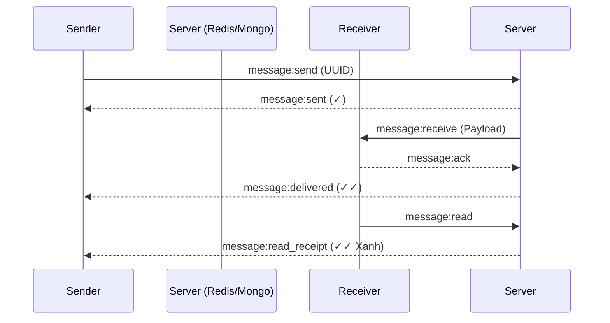

<p align="center">
  <h1 align="center">🔮 ALOHI — High-Performance Chat API v2.0</h1>
  <p align="center">
    <strong>Kiến trúc Offline-First (ưu tiên lưu trữ cục bộ) lấy cảm hứng từ Zalo & Telegram</strong><br/>
    <i>Được xây dựng cực mạnh mẽ với Node.js, Socket.IO, MongoDB & Redis</i>
  </p>
</p>

<p align="center">
  
  
  
  
  
  
</p>

---

## 📑 Mục Lục

1. [Tổng Quan Ngôn Ngữ Kiến Trúc](#-tổng-quan-kiến-trúc)
2. [Các Tính Năng Nổi Bật](#-các-tính-năng-nổi-bật)
3. [Luồng Xử Lý Hệ Thống](#-luồng-xử-lý-hệ-thống)
4. [Tech Stack](#-tech-stack)
5. [Cấu Trúc Thư Mục](#-cấu-trúc-thư-mục)
6. [Hướng Dẫn Cài Đặt & Khởi Chạy](#-hướng-dẫn-cài-đặt)
7. [Bảo Mật Cơ Sở Dữ Liệu](#-bảo-mật-cơ-sở-dữ-liệu)
8. [Tài Liệu Cụ Thể (API Docs)](#-tài-liệu-api)

---

## 🎯 Tổng Quan Kiến Trúc

**AloHi API** là hệ thống Backend chịu tải cao dành cho nền tảng chat đa phương tiện. Hệ thống thiết kế theo cơ chế **Offline-First**, với vai trò của Server giống như một **Message Relay** (trạm trung chuyển). Dữ liệu được push xuống client một cách nhanh nhất qua WebSockets, đồng thời duy trì khả năng đồng bộ trạng thái (Sent, Delivered, Read) một cách mượt mà.

### Các Tính Năng Nổi Bật

- 🔐 **Authentication Matrix:** Đăng ký/đăng nhập OTP, JWT Access/Refresh Token với vòng quay mã hóa tự động. Quản lý phiên đa thiết bị song song.
- 💬 **Real-time Messaging:** Tin nhắn 1-1, nhóm. Nhắn tin siêu tốc với `Socket.IO`. Hỗ trợ: *Văn bản, Hình ảnh, Video, Ghi âm (Voice Message), File Tài Liệu*.
- 📞 **Voice/Video WebRTC:** Tích hợp Signal Flow gọi thoại và gọi video thời gian thực thông qua Socket P2P.
- 🟢 **Presence System:** Tracking trạng thái *Online/Offline/Typing* chính xác tới mili-giây bằng Redis.
- 👥 **Social Graph:** Hệ thống đề xuất bạn bè, đồng bộ danh bạ từ điện thoại.
- ☁️ **Cloud Backup:** Lưu trữ và mã hóa bản sao lưu tin nhắn (AES-256).

---

## ⚙ Luồng Xử Lý Hệ Thống

### 1. Delivery Pipeline (Trạm Giao Nhận Tin Nhắn)
Cơ chế **3-Tick Validation** chuẩn quốc tế:


**Queuing tin nhắn Offline:** 
Nếu người nhận không ở trong trạng thái kết nối socket, tin nhắn sẽ chui vào queue của **Redis** & db MongoDB. Ngay khi họ truy cập ứng dụng, Socket `connect` event sẽ trigger hàm **Flush Queue** để đẩy lại toàn bộ tin nhắn.

### 2. Multi-Device Presence (Quản lý đa thiết bị)
- Sử dụng Redis làm caching tập trung: `user:{userId}:sockets = {socketId_1, socketId_2, ...}`
- Người dùng chỉ bị coi là **Offline** khi *toàn bộ* node socket ngắt kết nối. Có hệ thống `heartbeat` (30s) chống drop proxy ảo.

---

## 🛠 Tech Stack Cơ Bản

| Nhiệm Vụ | Công Nghệ Triển Khai | Mô tả |
|-------|-----------|---------|
| **Core Runtime** | `Node.js 22.x` & `Express 5.x` | Runtime tối giản, xử lý async non-blocking cực tốt |
| **Realtime Engine** | `Socket.IO 4.x` | Streaming Websocket / WebRTC Signaling |
| **Database** | `MongoDB 7.x (Mongoose)` | Database chính, schema cực kì linh hoạt cho Metadata chat |
| **Caching Layer** | `Redis 7.x (ioredis)` | Chống spam (rate limit), Queue tin nhắn, Pub/Sub trạng thái |
| **Security** | `JWT`, `bcryptjs`, `Helmet` | Access control, chống DDoS HTTP headers, sanitize dữ liệu |
| **Media Handling** | `Multer`, `Sharp` | Upload nén ảnh theo thời gian thực (Giảm băng thông) |
| **Process Manager**| `PM2` / `Docker` | Clustering & Containerize |

---

## 🚀 Hướng Dẫn Cài Đặt

### 1. Yêu cầu hệ thống
- `Node.js >= 20.x`
- `MongoDB >= 7.0` chạy local hoặc sử dụng Mongo Atlas.
- `Redis >= 7.0` (Mặc định cần có để giữ Real-time hoạt động trơn tru).

### 2. Clone & Bootstrap
```bash
git clone https://github.com/your-org/alohi-api.git
cd alohi-api
npm install
```

### 3. Cấu hình Tham Số Môi Trường
Sao chép `.env.example` thành `.env` và thiết lập các config nền tảng:
```env
PORT=3000
MONGODB_URI=mongodb://localhost:27017/alohi_prod
REDIS_HOST=localhost
REDIS_PORT=6379
JWT_ACCESS_SECRET=your_super_secret_access_key
JWT_REFRESH_SECRET=your_super_secret_refresh_key
UPLOAD_MAX_SIZE=100  # MB
```

### 4. Vận Hành Môi Trường DEV
Sử dụng Nodemon để tự động hot-reload khi dev:
```bash
npm run dev
# Mặc định server sẽ lắng nghe trên cổng :3000
```

### 5. Deloyment Production bằng PM2 & Docker
```bash
# PM2 Clustering (Sử dụng luồng đa nhân Node.js)
npm run pm2:start

# Docker compose để spin up nguyên stack (Mongo + Redis + Node)
npm run docker:up
```

---

## 📁 Cấu Trúc Thư Mục Chuẩn

Cấu trúc áp dụng thiết kế Separation of Concerns (SoC) mạnh mẽ:
```text
alohi-api/
├── 📄 server.js               # Điểm bắt đầu (Khởi tạo DB, Redis, HTTP, Socket)
├── 📂 docs/                   # Tài liệu API (REST & Socket.IO config)
├── 📂 src/
│   ├── app.js                 # Boilerplate cho Express stack (Middlewares)
│   ├── 📂 config/             # Chứa thông số hằng số (Database/Redis connect, Enum)
│   ├── 📂 controllers/        # Bộ điều khiển REST endpoint xử lý request/response
│   ├── 📂 middlewares/        # JWT Auth, Rate limiting Joi-validator, Error catcher
│   ├── 📂 models/             # Schema Mongoose (User, MessageQueue, Metadata...)
│   ├── 📂 routes/             # Cấu hình Router Express (auth.routes.js...)
│   ├── 📂 services/           # Lõi logic kinh doanh (AuthService, ChatService...)
│   ├── 📂 socket/             # Lõi logic cho Websocket Events P2P (chat.handler.js)
│   └── 📂 utils/              # Chứa Helpers (ErrorHandler, Logger, JWT tokenizer...)
└── 📂 uploads/                # File storage tự động sinh khi có file/audio/img truyền tới
```

---

## 🔒 Bảo Mật Cơ Sở Dữ Liệu

- **Rate Limiting:** Sử dụng Redis làm limiter. VD: Login (5req/15min), Message Event (60req/1min). Chặn triệt để Brute-force/Spam API.
- **Request Validation:** Thắt chặt toàn bộ format đầu vào (Tên, SDT, Password Regex) thông qua bộ quy tắc của thư viện `Joi`.
- **Media Validation:** Ngăn cản thực thi mã độc qua các Endpoints gửi file bằng cơ chế block extensions `.exe, .sh, .bat`.

---

## 📖 Tài Liệu API (Trích xuất)

Tài liệu được document đầy đủ bằng file Markdown nằm ở `docs/`:
- REST API Routing list chi tiết: 👉 `docs/API.md`
- Socket.IO Events Listeners list: 👉 `docs/SOCKET_EVENTS.md`

*(Hoặc sử dụng cổng truy xuất Swagger UI Local (nếu được kích hoạt): `http://localhost:3000/api-docs`)*

---
<p align="center">
  <i>Được thiết kế toàn diện bởi <b>AloHi Dev Team</b></i> 🥷💙
</p>
